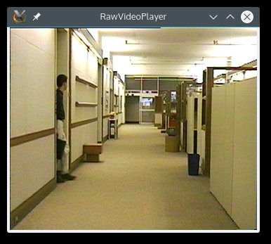
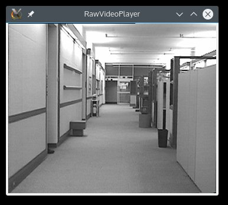
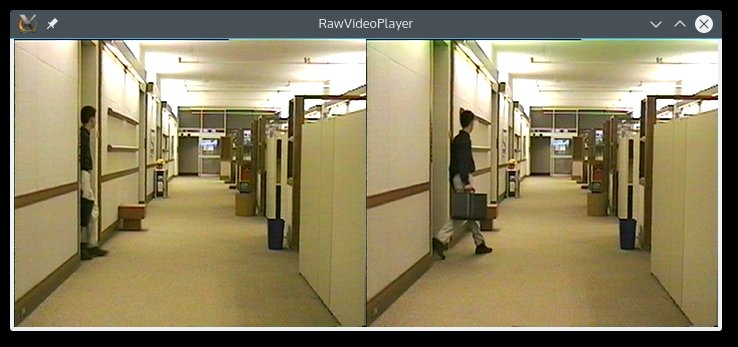

RawVideoPlayer
==============

RawVideoPlayer is a simple utility intended for Video Engineers to view/compare the Raw Video Files.  
It can play one/two files at a time for viewing or comparison.
Many raw YUV and RGB formats and 8bpp or 10bpp files are supported.  

## Options
```
+-----------------------------------------------+
|  Options:                                     |
|      -w : Width of frame                      |
|      -h : Height of frame                     |
|      -l : Display Width                       |
|      -b : Display Height                      |
|      -f : Frame Rate                          |
|      -d : Bit depth                           |
|      -m : Input Mode                          |
|      -k : Scale Factor                        |
|      -g : Grid On                             |
+-----------------------------------------------+
```

## Modes Supported
```
+-----------------------------------------------+
|           Input Format           |    Mode    |
+-----------------------------------------------+
|      Y Only                      |     -1     |
+-----------------------------------------------+
|      YUV420 Prog Planar          |      0     |
|      YUV420 Int  Planar          |      1     |
|      YVU420 Prog Planar          |      2     |
|      YVU420 Int Planar           |      3     |
|      YUV420 YCbCr Planar         |      4     |
+-----------------------------------------------+
|      YUV422 Prog Planar          |     10     |
|      YUV422 Int Planar           |     11     |
|      YVU422 Prog Planar          |     12     |
|      YVU422 Int Planar           |     13     |
+-----------------------------------------------+
|      UYVY Prog                   |     20     |
|      UYVY Int                    |     21     |
|      YUYV Prog                   |     22     |
|      YUYV Int                    |     23     |
|      YVYU Prog                   |     24     |
|      YVYU Int                    |     25     |
+-----------------------------------------------+
|      YUV444 Prog Planar          |     30     |
|      YUV444 Int Planar           |     31     |
|      YVU444 Prog Planar          |     32     |
|      YVU444 Int Planar           |     33     |
|      UYV444 Prog Planar          |     34     |
|      UYV444 Int Planar           |     35     |
+-----------------------------------------------+
|      YUV444 Prog Packed          |     40     |
|      YUV444 Int Packed           |     41     |
|      YVU444 Prog Packed          |     42     |
|      YVU444 Int Packed           |     43     |
|      UYV444 Prog Packed          |     44     |
|      UYV444 Int Packed           |     45     |
+-----------------------------------------------+
|      RGB Prog Planar             |     50     |
|      RGB Prog Packed             |     51     |
|      BGR Prog Planar             |     52     |
|      BGR Prog Packed             |     53     |
+-----------------------------------------------+
```

## Screenshots
```
# View file
rawvideoplayer infile1.yuv -w 352 -h 288
```


```
# View 10 bit file (in Little Endian Format)
rawvideoplayer infile1_10bpp.yuv -w 352 -h 288 -d 10
```


```
# View monochrome file
rawvideoplayer infile1_mono.yuv -w 352 -h 288 -m -1
```


```
# Compare two files
rawvideoplayer infile1.yuv infile2.yuv -w 352 -h 288
```


```
# Compare two files with gridlines on
rawvideoplayer infile1.yuv infile2.yuv -w 352 -h 288 -g 1
```

